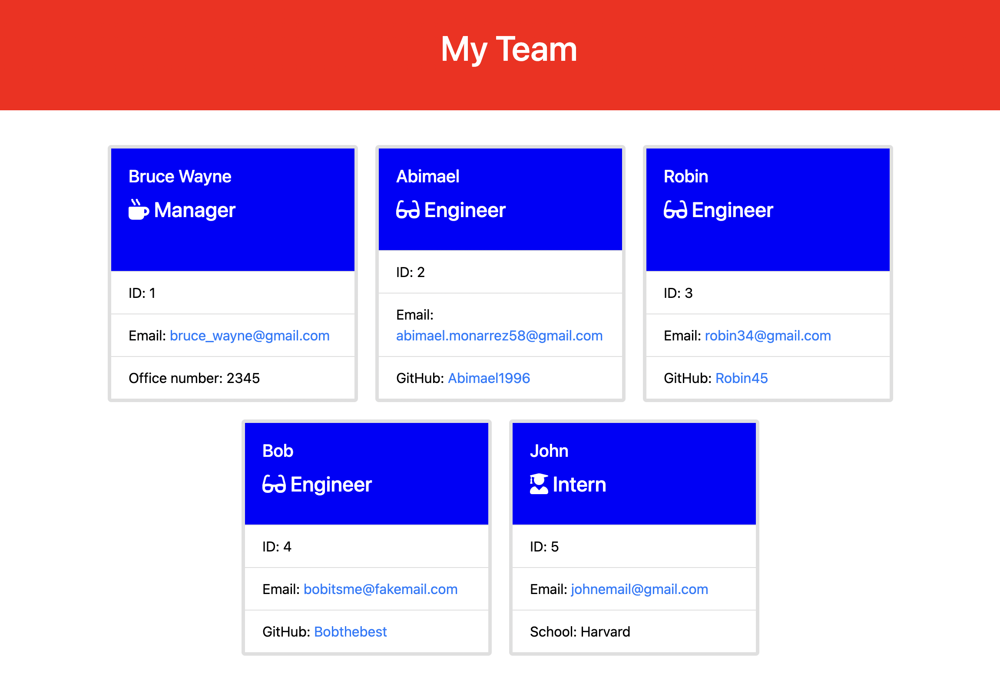

# Team Profile Generator

## Description
    
This app allows you to create an html file that will display the members of your team in cards. You just need to answer a series of questions about your team in the command line.

## List of Technologies

Jest | Inquirer | Node.js | JavaScript | CSS | HTML
    
## Installation

In order to install dependencies, run the following command: 

    npm i
    
## Usage
    
Clone or download the GitHub repository and navigate to it in the command line. After installing dependencies, run "node index". After you finish answering the questions, your html file will appear in the /dist folder.

Watch the Walkthrough [Video](https://watch.screencastify.com/v/KS3AkSe6VUGnDhUhzicE)

## Contribute
    
If you would like to contribute to this project, feel free to make a pull request in the GitHub repo.
    
## Tests

In order to run tests, run the following command: 

    npm test

## Questions

If you have any questions, open an issue or contact me directly at abimael.monarrez58@gmail.com. You can find more of my work at [Abimael1996](https://github.com/Abimael1996).

